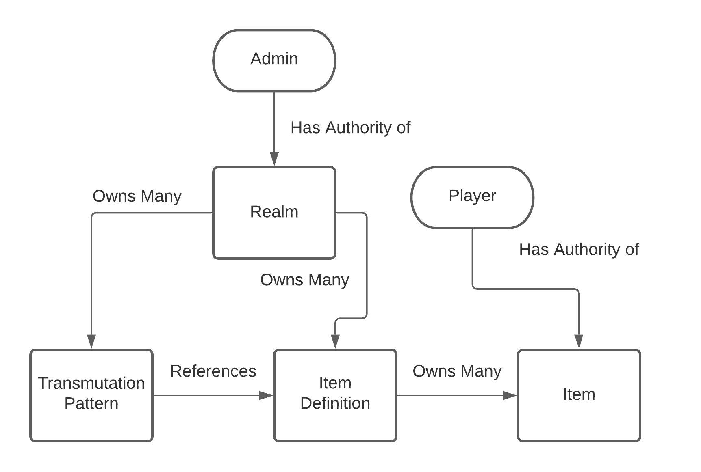
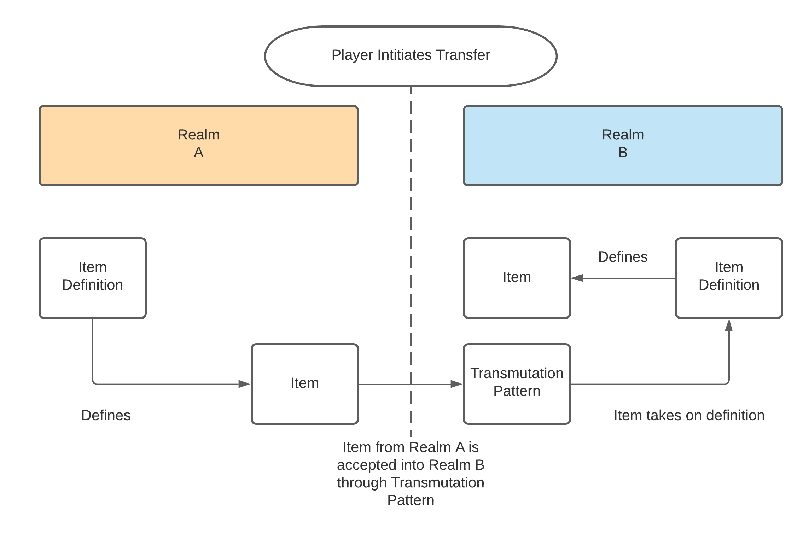
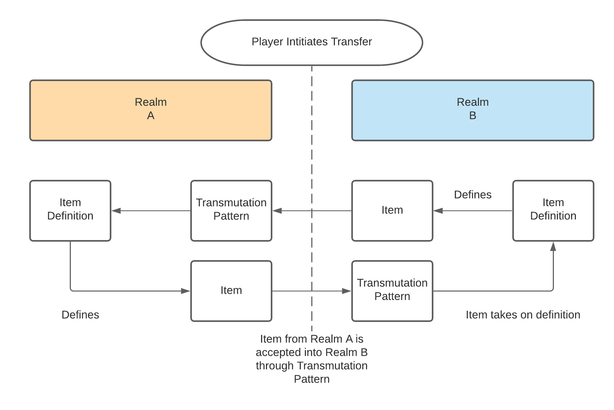
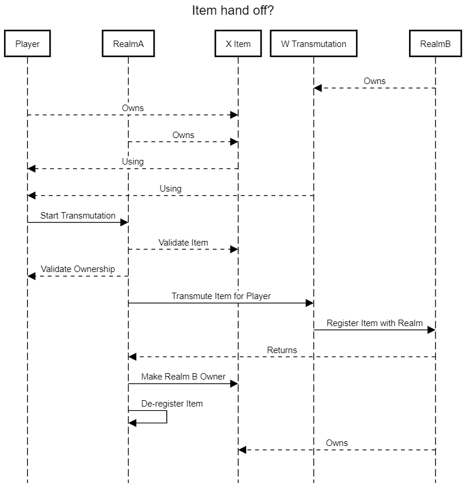

# Virtual (Game) Items

This is my activation challenge hack for dOrg (https://dorg.tech/)

## Personal Intro

My name is Zachary Nawar, however my online handle is Remscar.  
I'm a software engineer who started out in software when I began making games when I was a teenager. I went to a school dedicated around game development (the same one as Jordan Ellis, a member of dOrg) but from there went into the Tech industry. I've been working at Microsoft for the past three years where I was first introduced to Ethereum and writing smart contracts when I worked on a project with Moog to develop a [supply chain marketplace powered by Ethereum](https://www.moog.com/Innovation/DigitalManufacturing/Veripart.html).

## Project Description

So a long time ago I watched this ~~really bad~~ anime called Sword Art Online. I don't recommend you watch it, and if you do, only watch like the first 6 episodes, but there's this really cool idea in the anime where there's a bunch of MMO (Massive Multiplayer Online) games which were all based on the same underlying technology. People began making their own versions of the games but since they were based on the same tech, your characters stats and items would sometimes be "transferable" over into other games.

This idea of a having parallelism between games, whether that be characters, stats, or items, is really interesting to me. In a practical sense, or at least in a game design sense, it really probably wouldn't work out, but i've always wanted to brainstorm and create a system that would allow it. In my mind this sort of system would be perfect for the blockchain since I would want it to be completely open for anyone to view or hook into.

For this project i'm going to both design and implement a POC of this concept. I'm going to be documenting and going in-depth in my design-process and thoughts throughout.

## Time Frame

6 hours - Time isn't always something I have a lot of, and I don't want to be working on this across multiple days so this will probably be done in just one session (with breaks.)

## Running the project

I haven't tested on a clean environment, but running `yarn` and then `yarn test` should work. Unless theres a yarn install or something, dunno, new to yarn.

(I tried to use NPM but I needed something that was only supported by yarn, which i've never used before... so yeah)

## Design

I'm going to call the concept of individual games, `Realms` because I think it sounds neat.

For a given `Realm` there exist a collection of `Item Definitions`.

An `Item Definition` uniquely defines a type of `Item`.

An `Item` is an instance of an "object" defined by an `Item Definition` which belongs to a `Player`.

A `Realm` may create `Items` from `Item Definitions` and grant them to a `Player`.

### Design Question: Do items exist in two realms at once, or do they have to be transferred?

This question has big implications on the rest of the system.

- I have an Apple in Realm A which means I have a banana in Realm B.
- I eat the banana in Realm B, which logically means I shouldn't have an Apple in Realm A anymore.
- How does Realm B enforce that the item has been destroyed in Realm A?
- Does Realm B create a "copy" of the item for the player inside of Realm B?
- How is the transfer actually performed?
- Do Realms grant authority to other realms to manipulate their items?
- Do items transfer back and forth between realms based on an agreed transfer mapping?

I like the idea of items transferring between realms. An item can only exist in one realm at a time, but it can be transferred (at will) between different realms, allowing it to take on different properties in whatever realm it's in.

An item can only be transferred from one realm to another if the realms have an agreed upon mapping. An `apple` from `Realm A` turns into a `banana` in `Realm B`, and vice-versa.

#### Answer

An item may only exist in one realm at a time. To be used in another realm it must be `converted`, `transferred`, or `transmuted`. Lots of cool words could be used, kind of like transmute since it sounds real game-ish.

A `Realm` must define a `transmutation` pattern to allow an `Item` to be transferred from another `Realm` into it's own `Realm`.

A `transmutation` pattern defines an `Item Definition` in another `Realm` to an `Item Definition` in this realm.

Diagrams because I like them.

#### Diagram of ownership hierarchy

Even though the Item Definition "Owns" or "Defines" an Item inside of a Realm, the player has authority over that item, allowing the Item to be manipulated by the player.

#### Transfer process diagram

A `player` can initiate the transfer of an `Item` between one `Realm` to another. Since the `player` has authority over the `Item` they can cause the `Item` to be moved to a `Transmutation` pattern in another `Realm`, thus releasing the `Item` from the first `Realm` and having it exist inside of the new `Realm`.

While these `Transmutation` patterns could be circular, they don't necessarily have to be, in fact I think it's almost cooler if there are ones that aren't.

#### Transfer process diagram with a loop

## Time to implement?

At this point I think I have a good idea of the overall design of the system, now to implement it inside of Smart Contracts.

I think the ownership/authority part of this will be a bit tricky, and i'll have to think about attack scenarios to make sure I implement this correctly.

So far I've identified a few discrete entities:

- Realm
- Item Definition
- Item
- Transmutation Pattern

I could implement this into one mega Smart Contract if I wanted to, but I'm going to try separating each of these entities into their own Smart Contract, define interfaces for each, and implement them separately. Optimization can come later.

## Implementation / Journal of work

I haven't developed Smart Contracts in almost two years, so i'm gonna be remembering while I go.

Marking the times in this as Hours:Minutes from after getting my dev environment setup. I estimate that I worked ~1.5 hours before the first entry writing this stuff up and doing the design.

### +0:00 (H:MM)

Setting up my dev environment took longer than expected. I used truffle before so I figured out how to get that working again. I also found something called `typechain` which allows me to program in TypeScript which I highly prefer over plain old JavaScript.

I'm going to be creating the contracts and developing tests to prove their functionality.

I'll start with the Realm contract, but first I need to figure out how to make Solidity interfaces again.

Made the first commit.

### +1:05

Started to flesh out more of the contracts. Had to brush up on storage vs memory and the new solidity stuff.

Realizing the the hand-off between the two realms is going to be a bit tricky.

Thinking of writing a sequence diagram of it.

Took a break.

### +3:00

Figuring out sequence of handing off an item between one realm to another.

A `Realm` needs to keep track of all items a player owns. When a item gets moved from one realm to another, it needs to be removed from one realm and added to the other.

### +3:40

Main code is done in the contracts. Ditched all of the interfaces since this is a hack and it takes too much time to fix them. I'm remembering all of those strange quirks working with Solidity now.

Now it's time to write the tests to make sure it works.

### +4:00

Tests are coming along. Need to stop for the day.

### +4:00 (next day)

Going to spend roughly an hour today to do one or two more tests, just to prove that the transmutation works. I expect that there are going to be a lot of security vulnerabilities and better ways of doing things, but I'm not going to have the time to actually figure those out all the way or implement them.

### +4:20

Finished the End 2 End test and it works! An item can be created in Realm A, and then transferred to Realm B, and the item definition and realm owner on the item will be updated as well.

I'm going to consider this done, I set out and achieved a proof-of-concept of the core idea. Writing the outcome section now.

## Outcome

I was successfully able to create a proof of concept. I learned quite a few new things during it, and was able to warm my Solidity skills back up, it's really cool to see how far the language has come in two years.

There are some gripes I have about my development stack, for instance even though I used TypeChain, truffle tests can't actually use typescript features, i'll have to see if there's a way around this but I didn't want to spend the time during this hack to figure that out.

Additionally there are some things in Solidity that I've forgotten about, which I find a bit annoying. For instance there isn't an implicit cast between between a Smart Contract and an address. This meant a lot of my code had to explicitly cast an instance of a contract to an address when calling another contract. There might be ways around this, such as make the parameters the contracts themselves, but I didn't realize that was possible until I had already written some of my contracts.

I also forgot about how difficult it is to delete an arbitrary element in an array by value. It would be a bad idea to have the contract iterate through the array to delete a given element, so that iteration will have to be offloaded out of the contract and into the caller code. This is a bit annoying since that means the contract will have to accept another parameter which would be the index of the thing that i'm trying to delete, and then additional logic to verify that, but I guess that's just life.

Looking back at the work I did, there are a handful of things I would change. Firstly I would've eliminated the "Item Definition" contract and just made it a hash or unique identifier. There is no logic contained in it, so there's no point at this stage. There are also a few things I would've explored more, like control and management over items. I forgot a lot about how designing trust and security in smart contracts, especially when they interact with one another. It's always a fun problem, and if I were to continue working on this I would probably throw out 99% of the code I have and re-engineer it entirely.

There are also a lot of guard rails and safety measures missing in my code, it's a POC so I guess that's fine though.

